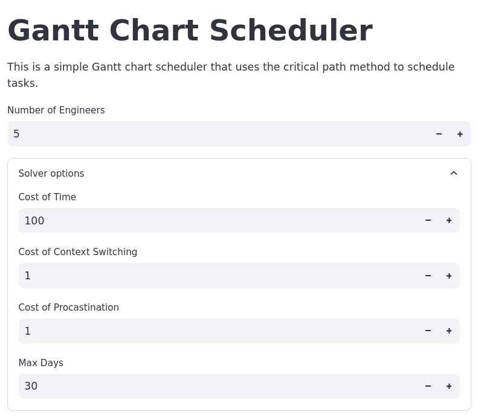
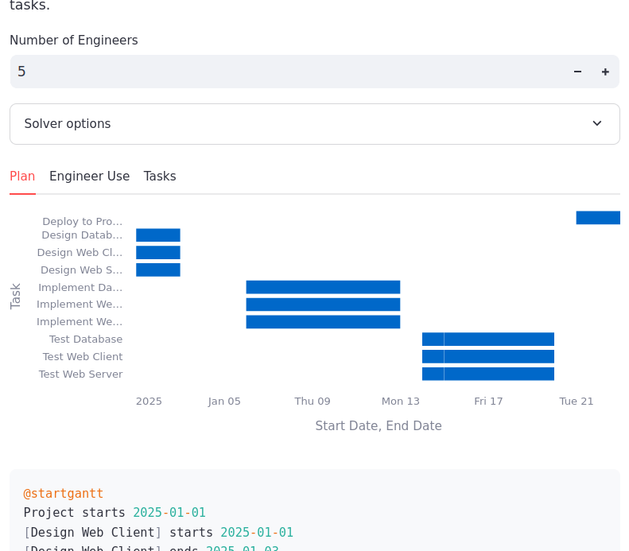
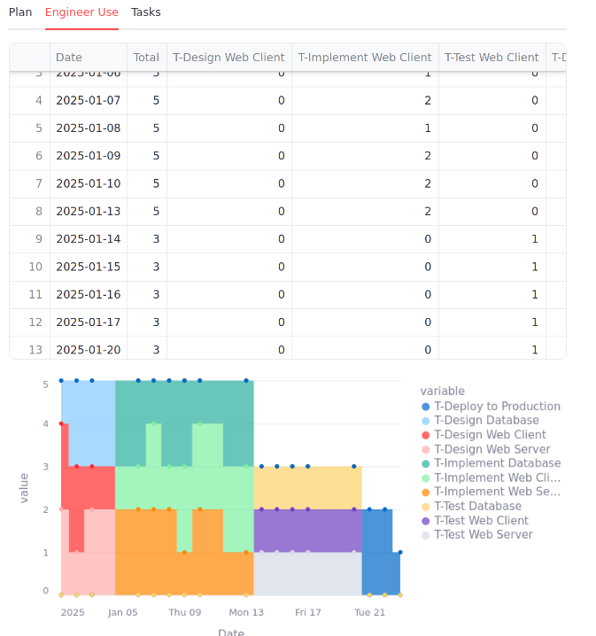
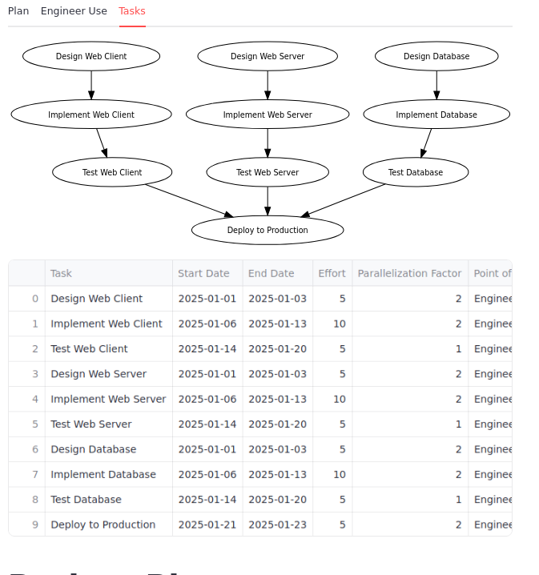

# ganttdsl

GanttDSL is a Python-based Domain-Specific Language (DSL) designed to simplify project planning and scheduling for software engineering teams. With GanttDSL, you can define tasks, teams, and dependencies in a clear, literate programming style, and generate detailed project views in Markdown or visualize timelines with PlantUML-compatible Gantt charts.

## Project Description

GanttDSL aims to provide a tool to manage project schedules, focusing on minimizing context switching and ensuring tasks are completed as soon as possible. It leverages the [Critical Path Method](https://en.wikipedia.org/wiki/Critical_path_method) to prioritize tasks that directly impact the project's completion time. GanttDSL is aware of non-working days, such as weekends, and allows for custom workday filters to be applied. 

## Features

- Define tasks with descriptions, references, points of contact, effort estimates, and dependencies.
- Create teams with specified sizes.
- Schedule tasks using the Critical Path Method.
- Generate Markdown views of the project plan.
- Produce Gantt charts in PlantUML format.

## Installation

To install GanttDSL, use the following command:

```sh
pip install ganttdsl
```
## Usage Example

Use the dsl to define tasks for your project.
The remaining `effort` of a task is the number of days of work required to complete it while the `parallelization_factor` of a task is the number of engineers that can be assigned to work on it concurrently.

```python
from datetime import date
from ganttdsl.dsl import Task, Team, CriticalPathScheduler

task_design_web_client = Task(
    name="Design Web Client",
    description="Design the web client interface.",
    references=["https://example.com/web-client-design"],
    point_of_contact="Engineer A",
    effort=5,
    parallelization_factor=2,
)
```
Task can depend on other task by setting the `dependencies` set.
```python
task_implement_web_client = Task(
    name="Implement Web Client",
    description="Implement the web client based on the design.",
    references=["https://example.com/web-client-implementation"],
    point_of_contact="Engineer B",
    effort=10,
    parallelization_factor=3,
    dependencies={task_design_web_client}
)
```

Once you have a bunch of interdependent tasks you can schedule them on a team of engineers.
```python
tasks = [
    task_design_web_client, task_implement_web_client, task_test_web_client,
    task_design_web_server, task_implement_web_server, task_test_web_server,
    task_design_database, task_implement_database, task_test_database,
    task_deploy_to_production
]

scheduler = CriticalPathScheduler()
plan = scheduler.schedule(tasks, Team(name="Engineering Team", size=5), start_date)
```
## Intended use
The project is tracked by a git repository with a python library inside.
This library uses [the primitives of `ganttdsl`](tutorial.md) to define the tasks.

A [streamlit application](server.py) or other interactive tools can be used to explore the optimal schedules of the project.

Every time the project is updated, like during a standup, the code is also edited to reflect the latest estimates of remaining effort.

The project history is tracked in the git history while the repository contains the current projection of the project trajectory in the future.







