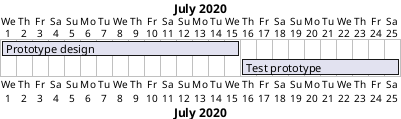

# Gantt DSL design and prompt
I want to write a python embeddeded DSL to create gant charts : GanttDsl.

We want to track the stories and the project activities of a software engineering team writing them in python, sort of literate programming style.

We also want to generate a markdown view of the project and a plantuml gantt chart.

### Tasks
For each task we want to track the name, a description, links to references, an engineer as a point of contact. Each task should have an effort intensity estimation (the number of days one engineer would take to complete the task) and the maximum parallelization factor (the number of engineers that can work concurrently on the task).
* class Task


example : If a task has effort intensity 6 and parallelization factor 2 it can be done in 3 days if 2 or more engineers are available and are allocated on this task or in 6 days using only one engineer.

The description of the task must support markdown formatting so engineers can write down their thoughts and ideas in a structured way.


Tasks have dependencies: if task A depends on task B then A cannot start unless B has already completed.
* task.dependencies: set[Task]


### Scheduling
A Scheduler can be used to take a start date, a bunch of task specifications and a team specification and produce a Plan that describe how the team can complete the task starting from the start date.
* class Scheduler
* class Plan
Keep the Scheduler class as abstract as we don't want to bake into this any specific scheduling algorithm or behavior.
Concrete schedulers will be implemented as subclasses of Scheduler.

A team specification is just the team name and the number of engineers.
* class Team
A plan contains Planned Tasks : each plannned task refer to a task that was provided to the scheduler and tracks how many engineers were allocated on each day.
Days can be tracked both as integers of working days from the start date of the plan (day=0) or as absolute dates (ie datetime.date) and no work should be scheduled on weekends.
* class PlannedTask 


### Plan Presentation
The scheduler should be able to produce a markdown view of the plan, listing the all the planned tasks in a detailed and organized fashion.
* Plan.get_markdown_view() -> str
The scheduler should be able to produce a gantt chart of the plan.
* Plan.get_gantt_chart() -> str

the generated gantt chart string looks a bit like this:


### Critical Path Scheduling
A CriticalPathScheduler is a scheduler that always schedules the tasks on the critical path first.
A shortest path algorithm can be used to find the critical path of the project and the tasks on the critical path are the tasks that have the longest path from the start to the end of the project.
The CriticalPathScheduler second priority is to maximise the utilization of engineering teams.

The "end of the project" is the set of tasks that no other task depends on.

### FAQs and Clarifications

Q : Can tasks have multiple dependencies, and do circular dependencies need to be explicitly handled or validated?
Tasks can depend on multiple tasks. A task can start only after all dependencies have been completed.

Circular dependencies are not allowed and the scheduler should raise an exception when detecting this corner case.

Q :  Should the scheduler assume that all engineers have identical skill levels and efficiency?

Yes. All engineers are equal for scheduling. The only reason we have engineer names is to track who is a point of contact for a certain task in case we want to know who should we ask to.

Q : Should tasks have unique identifiers beyond their name for easier tracking?

Yes, task names should be unique and the scheduler should raise an exception when detecting duplicated task names.

Q : Should the Markdown descriptions support embedding links and inline images (for example, diagrams)?

Yes. Engineers are trusted and we don't want to get in their way when they document stuff as they please.

Q : Will weekends always be non-working days, or should holidays and other specific days be configurable as non-working?

Keep it simple and allow the injection of a WorkdayFilter in the scheduler.
The workday filter takes a datetime.date and returns True if it is a workday or false otherwise.
Use the standard library to provide a sensible default for this callback.

Q : Should engineers be explicitly assigned to tasks in the plan, or is it sufficient to specify the number of engineers?

Just specify the number of engineers.

Q : Should the Markdown view of the plan include:
    Task Name?
    Task Description?
    Effort estimates?
    Dependencies?
    Engineer assignments?
    Links to task references?

All of the above.


## Design Document

## Overview

The scheduling system is designed to manage and allocate engineering resources for tasks in a project. The system ensures that tasks are scheduled based on their dependencies and the availability of engineering resources.

## Classes

### Task

Represents a task in the project.

- `name: str`
- `description: str`
- `references: List[str]`
- `point_of_contact: str`
- `effort: int` (in engineer-days)
- `parallelization_factor: int`
- `dependencies: Set[Task]`

### ScheduledTask

Represents a scheduled task with start and end dates, and the allocation of engineers on each day.

- `task: Task`
- `start_date: int`
- `end_date: int`
- `daily_engineer_allocation: Dict[int, int]` (new attribute to track engineer allocation per day. keys are the date indexes and the values are the number of engineers working on the project on a given date)

### Plan

Represents the plan for the project, containing all scheduled tasks.

- `scheduled_tasks: List[ScheduledTask]`

#### Methods

- `get_markdown_view() -> str`: Returns a markdown representation of the plan.
- `get_gantt_chart() -> str`: Returns a Gantt chart representation of the plan.

### Scheduler

Base class for scheduling tasks.

#### Methods

- `has_circular_dependencies(tasks: List[Task]) -> bool`: Checks for circular dependencies among tasks.

### CriticalPathScheduler

Inherits from `Scheduler` and implements the scheduling logic.

#### Methods

- `schedule(tasks: List[Task], team: Team, start_date: date) -> Plan`: Schedules the tasks based on dependencies and resource availability.

### Team

Represents a team of engineers.

- `name: str`
- `size: int`

## Scheduling Logic

The `CriticalPathScheduler` class schedules tasks based on their dependencies and the availability of engineering resources. The scheduling process involves the following steps:

1. **Detect Circular Dependencies**: Ensure there are no circular dependencies among tasks.
2. **Topological Sort**: Sort tasks based on their dependencies.
3. **Calculate Duration**: Calculate the duration of each task based on its effort and parallelization factor.
4. **Allocate Resources**: Allocate engineers to the task day by day, ensuring that the total number of engineers does not exceed the team's size.
5. **Track Engineer Allocation**: Track the allocation of engineers for each day in the `daily_engineer_allocation` attribute of the `ScheduledTask` class.

### Resource Allocation

The `schedule` method in the `CriticalPathScheduler` class allocates resources as follows:

1. Calculate the start time for each task based on its dependencies.
2. Calculate the duration of each task based on its effort and parallelization factor.
3. Allocate engineers to the task day by day, ensuring that the total number of engineers does not exceed the team's size.
4. Track the allocation of engineers for each day in the `daily_engineer_allocation` attribute of the `ScheduledTask` class.

## Example

```python
task_a = Task(
    name="Prototype Design",
    description="Design the prototype.",
    references=[],
    point_of_contact="Engineer A",
    effort=10,
    parallelization_factor=2
)
task_b = Task(
    name="Build Prototype",
    description="Build the prototype, depends on Task A.",
    references=[],
    point_of_contact="Engineer B",
    effort=8,
    parallelization_factor=4,
    dependencies={task_a}
)
team = Team(name="Engineering Team", size=3)
scheduler = CriticalPathScheduler()
start_date = date(2025, 1, 1)

plan = scheduler.schedule([task_a, task_b], team, start_date)