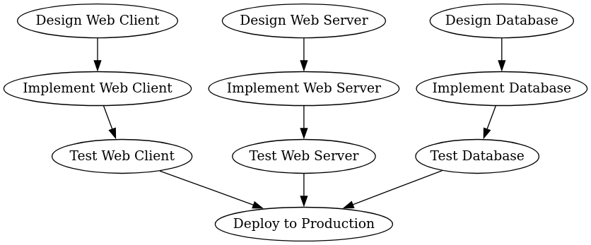
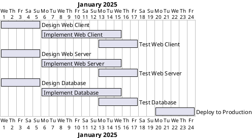
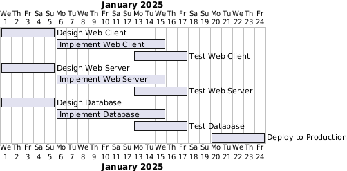

# GanttDSL Tutorial
GanttDSL is an elaborate plot to avoid using JIRA while getting something radically better in return : automated critical path planning.

GanttDSL is a python embedded DSL to write the stories you have to work on for a project or as part of a team.

What GanttDSL brings to the table is a constrained optimizer to schedule the work so it gets done as soon as possible and minimizing context switching.

GanttDSL is aware that engineers don't work on weekends and you can inject a workday filter.

Plans can be rendered in markdown and gantt charts can be produced in plantuml format.

#### Step 1: Define Tasks

First, let's define the tasks for our 3-tier project. Each task has a name, description, references, point of contact, effort, parallelization factor, and dependencies.

```python
from datetime import date
from ganttdsl.dsl import Task, Team, CriticalPathScheduler

# Define tasks for the 3-tier project

# Web Client Tasks
task_design_web_client = Task(
    name="Design Web Client",
    description="Design the web client interface.",
    references=["https://example.com/web-client-design"],
    point_of_contact="Engineer A",
    effort=5,
    parallelization_factor=2,
    dependencies=set()
)

task_implement_web_client = Task(
    name="Implement Web Client",
    description="Implement the web client based on the design.",
    references=["https://example.com/web-client-implementation"],
    point_of_contact="Engineer B",
    effort=10,
    parallelization_factor=2,
    dependencies={task_design_web_client}
)

task_test_web_client = Task(
    name="Test Web Client",
    description="Test the web client implementation.",
    references=["https://example.com/web-client-testing"],
    point_of_contact="Engineer C",
    effort=5,
    parallelization_factor=1,
    dependencies={task_implement_web_client}
)

# Web Server Tasks
task_design_web_server = Task(
    name="Design Web Server",
    description="Design the web server architecture.",
    references=["https://example.com/web-server-design"],
    point_of_contact="Engineer D",
    effort=5,
    parallelization_factor=2,
    dependencies=set()
)

task_implement_web_server = Task(
    name="Implement Web Server",
    description="Implement the web server based on the design.",
    references=["https://example.com/web-server-implementation"],
    point_of_contact="Engineer E",
    effort=10,
    parallelization_factor=2,
    dependencies={task_design_web_server}
)

task_test_web_server = Task(
    name="Test Web Server",
    description="Test the web server implementation.",
    references=["https://example.com/web-server-testing"],
    point_of_contact="Engineer F",
    effort=5,
    parallelization_factor=1,
    dependencies={task_implement_web_server}
)

# Database Tasks
task_design_database = Task(
    name="Design Database",
    description="Design the database schema.",
    references=["https://example.com/database-design"],
    point_of_contact="Engineer G",
    effort=5,
    parallelization_factor=2,
    dependencies=set()
)

task_implement_database = Task(
    name="Implement Database",
    description="Implement the database based on the design.",
    references=["https://example.com/database-implementation"],
    point_of_contact="Engineer H",
    effort=10,
    parallelization_factor=2,
    dependencies={task_design_database}
)

task_test_database = Task(
    name="Test Database",
    description="Test the database implementation.",
    references=["https://example.com/database-testing"],
    point_of_contact="Engineer I",
    effort=5,
    parallelization_factor=1,
    dependencies={task_implement_database}
)

# Deployment Tasks
task_deploy_to_production = Task(
    name="Deploy to Production",
    description="Deploy the entire system to production.",
    references=["https://example.com/deployment"],
    point_of_contact="Engineer J",
    effort=5,
    parallelization_factor=2,
    dependencies={task_test_web_client, task_test_web_server, task_test_database}
)
```

#### Step 2: Define the Team

Next, define the team that will work on these tasks. The team has a name and a size (number of engineers).

```python
# Define the team
team = Team(name="Engineering Team", size=5)
```

#### Step 3: Schedule the Tasks

Now, use the `CriticalPathScheduler` to schedule the tasks. The scheduler will take the tasks, team, and start date as input and produce a plan.

```python
# Create the scheduler
scheduler = CriticalPathScheduler()

# Define the start date
start_date = date(2025, 1, 1)

# Schedule the tasks
tasks = [
    task_design_web_client, task_implement_web_client, task_test_web_client,
    task_design_web_server, task_implement_web_server, task_test_web_server,
    task_design_database, task_implement_database, task_test_database,
    task_deploy_to_production
]
plan = scheduler.schedule(tasks, team, start_date)
```

#### Step 4: Generate Markdown View

You can generate a markdown view of the plan to get a detailed and organized representation of the scheduled tasks.

```python
# Generate markdown view
markdown = plan.get_markdown_view()
print(markdown)
```

The output will look like the example after the gantt chart.

#### Step 5: Generate Gantt Chart

You can also generate a Gantt chart view of the plan to visualize the project timeline.

```python
# Generate Gantt chart
gantt_chart = plan.get_gantt_chart()
print(gantt_chart)
```

The output will look like this:





# Project Plan

## `Design Web Client`

Design the web client interface.

**Effort**: 5 days

**Parallelization Factor**: 2

**Point of Contact**: Engineer A

**References**:

  - [https://example.com/web-client-design](https://example.com/web-client-design)


**Dependencies**:


### Schedule

| Date | Engineers |
|------|-----------|
| 2025-01-01 | 2 |
| 2025-01-02 | 2 |
| 2025-01-03 | 1 |
## `Implement Web Client`

Implement the web client based on the design.

**Effort**: 10 days

**Parallelization Factor**: 2

**Point of Contact**: Engineer B

**References**:

  - [https://example.com/web-client-implementation](https://example.com/web-client-implementation)


**Dependencies**:

  - `Design Web Client`


### Schedule

| Date | Engineers |
|------|-----------|
| 2025-01-06 | 2 |
| 2025-01-07 | 2 |
| 2025-01-08 | 2 |
| 2025-01-09 | 2 |
| 2025-01-10 | 2 |
## `Test Web Client`

Test the web client implementation.

**Effort**: 5 days

**Parallelization Factor**: 1

**Point of Contact**: Engineer C

**References**:

  - [https://example.com/web-client-testing](https://example.com/web-client-testing)


**Dependencies**:

  - `Implement Web Client`


### Schedule

| Date | Engineers |
|------|-----------|
| 2025-01-13 | 1 |
| 2025-01-14 | 1 |
| 2025-01-15 | 1 |
| 2025-01-16 | 1 |
| 2025-01-17 | 1 |
## `Design Web Server`

Design the web server architecture.

**Effort**: 5 days

**Parallelization Factor**: 2

**Point of Contact**: Engineer D

**References**:

  - [https://example.com/web-server-design](https://example.com/web-server-design)


**Dependencies**:


### Schedule

| Date | Engineers |
|------|-----------|
| 2025-01-01 | 2 |
| 2025-01-02 | 2 |
| 2025-01-03 | 1 |
## `Implement Web Server`

Implement the web server based on the design.

**Effort**: 10 days

**Parallelization Factor**: 2

**Point of Contact**: Engineer E

**References**:

  - [https://example.com/web-server-implementation](https://example.com/web-server-implementation)


**Dependencies**:

  - `Design Web Server`


### Schedule

| Date | Engineers |
|------|-----------|
| 2025-01-06 | 2 |
| 2025-01-07 | 2 |
| 2025-01-08 | 2 |
| 2025-01-09 | 2 |
| 2025-01-10 | 2 |
## `Test Web Server`

Test the web server implementation.

**Effort**: 5 days

**Parallelization Factor**: 1

**Point of Contact**: Engineer F

**References**:

  - [https://example.com/web-server-testing](https://example.com/web-server-testing)


**Dependencies**:

  - `Implement Web Server`


### Schedule

| Date | Engineers |
|------|-----------|
| 2025-01-13 | 1 |
| 2025-01-14 | 1 |
| 2025-01-15 | 1 |
| 2025-01-16 | 1 |
| 2025-01-17 | 1 |
## `Design Database`

Design the database schema.

**Effort**: 5 days

**Parallelization Factor**: 2

**Point of Contact**: Engineer G

**References**:

  - [https://example.com/database-design](https://example.com/database-design)


**Dependencies**:


### Schedule

| Date | Engineers |
|------|-----------|
| 2025-01-01 | 2 |
| 2025-01-02 | 2 |
| 2025-01-03 | 1 |
## `Implement Database`

Implement the database based on the design.

**Effort**: 10 days

**Parallelization Factor**: 2

**Point of Contact**: Engineer H

**References**:

  - [https://example.com/database-implementation](https://example.com/database-implementation)


**Dependencies**:

  - `Design Database`


### Schedule

| Date | Engineers |
|------|-----------|
| 2025-01-06 | 2 |
| 2025-01-07 | 2 |
| 2025-01-08 | 2 |
| 2025-01-09 | 2 |
| 2025-01-10 | 2 |
## `Test Database`

Test the database implementation.

**Effort**: 5 days

**Parallelization Factor**: 1

**Point of Contact**: Engineer I

**References**:

  - [https://example.com/database-testing](https://example.com/database-testing)


**Dependencies**:

  - `Implement Database`


### Schedule

| Date | Engineers |
|------|-----------|
| 2025-01-13 | 1 |
| 2025-01-14 | 1 |
| 2025-01-15 | 1 |
| 2025-01-16 | 1 |
| 2025-01-17 | 1 |
## `Deploy to Production`

Deploy the entire system to production.

**Effort**: 5 days

**Parallelization Factor**: 2

**Point of Contact**: Engineer J

**References**:

  - [https://example.com/deployment](https://example.com/deployment)


**Dependencies**:

  - `Test Database`
  - `Test Web Server`
  - `Test Web Client`


### Schedule

| Date | Engineers |
|------|-----------|
| 2025-01-20 | 2 |
| 2025-01-21 | 2 |
| 2025-01-22 | 1 |
